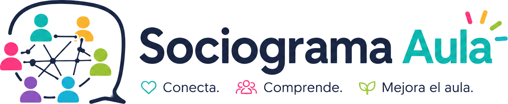

<div align="center">
  
  <h1>Sociograma Aula</h1>
  <p><strong>Sociometría gratuita para entender las relaciones de tu grupo</strong></p>
  <p>
    <a href="https://sergarb1.github.io/SociogramaAula/">
      
    </a>
    <a href="https://github.com/sergarb1/SociogramaAula/blob/main/README.md">
      
    </a>
    
    
    
  </p>
  <p>
    <strong>Grafo interactivo &middot; Métricas automáticas &middot; Formación de equipos &middot; 100% offline y gratuito</strong>
  </p>
  <p><em>Detecta dinámicas ocultas, forma equipos equilibrados y mejora la convivencia en el aula.</em></p>
</div>

---

## 🚀 En un clic

Sin registro, sin instalación, sin servidor.

| | |
|---|---|
| **🌐 Web** | [sergarb1.github.io/SociogramaAula](https://sergarb1.github.io/SociogramaAula/) |
| **📱 PWA** | Abre la web → "Instalar" en el menú del navegador |
| **💻 Local** | `git clone` + `npm install && npm run dev` |

---

## ✨ Funcionalidades

<details open>
<summary><strong>🧠 Sociometría</strong></summary>

| | |
|---|---|
| 📋 | **Cuestionario sociométrico** con 15 preguntas configurables y 6 plantillas por nivel educativo |
| 🔄 | **Auto-guardado** — respuestas guardadas al instante con aviso de cambios sin guardar |
| 🕸️ | **Grafo interactivo** (vis-network) — colores por rol, flechas elección/rechazo, física suave |
| 📊 | **Métricas automáticas** — cohesión, densidad, aislamiento, reciprocidad |
| 🔮 | **Predicciones inteligentes** — detección de líderes, aislamiento, conflictos con recomendaciones |
| 📝 | **Editor manual** — matriz editable clic a clic o drag & drop entre alumnos |

</details>

<details>
<summary><strong>👥 Gestión y equipos</strong></summary>

| | |
|---|---|
| 🏫 | **Grupos ilimitados** con lista reordenable por arrastre |
| 📋 | **Plantillas prediseñadas** — 14 modelos (Primaria, ESO, Bachillerato, FP) |
| 📄 | **Importación CSV** de listados de alumnos |
| ➕ | **Añadido masivo** — varios nombres de una vez |
| 🔎 | **Buscador de alumnos** con filtro en tiempo real |
| 👥 | **Formación de equipos** equilibrada por roles, elecciones y rechazos |
| 🎲 | **Semilla aleatoria** para equipos reproducibles |

</details>

<details>
<summary><strong>🏫 Distribución y exportación</strong></summary>

| | |
|---|---|
| 🪑 | **Plano de clase interactivo** — 3 disposiciones: cuadrícula, filas, en U |
| 🔄 | **Arrastra alumnos** entre mesas para reordenar |
| 📦 | **Exportación JSON** — datos completos (importable/exportable) |
| 📄 | **Informe HTML** profesional imprimible |
| 🖼️ | **Exportación PNG** del grafo y la distribución |
| 📋 | **CSV** — listado de alumnos y matriz sociométrica |
| 🤖 | **Exportación anonimizada** (S_01, S_02…) para análisis con IA |

</details>

<details>
<summary><strong>🔒 Privacidad y técnica</strong></summary>

| | |
|---|---|
| 🔒 | **100% local** — datos en IndexedDB, nunca salen del navegador |
| 📱 | **PWA instalable** — funciona sin internet |
| 🌙 | **Modo oscuro/claro** con persistencia |
| 🌍 | **Multi-idioma**: Español, English |
| ✅ | **Cumple LOPDGDD / GDPR** — sin tratamiento externo de datos |

</details>

---

## 🛠️ Stack técnico

| Frontend | Build | Persistencia | Despliegue |
|---|---|---|---|
| **Vue 3** + TypeScript SFCs | **Vite 6** | **IndexedDB** (idb-keyval) | **GitHub Pages** |
| **Tailwind CSS v3** (PostCSS) | `vue-tsc` typecheck | JSON export/import | GitHub Actions |
| **vis-network** (npm) | HMR en desarrollo | PWA offline-ready | |
| **html2canvas** + **Chart.js** | | | |

**Offline nativo** — todo empaquetado por Vite, cero dependencias externas en runtime.

---

## 📁 Estructura

```
SociogramaAula/
├── index.html              ← Entry point Vite (<div id="app"> + /src/main.ts)
├── ayuda.html              ← Página de ayuda (estática)
├── manual.html             ← Manual de usuario (estático)
├── AGENTS.md               ← Guía para asistentes IA
├── README.md
├── src/
│   ├── main.ts             ← createApp + mount
│   ├── App.vue             ← Componente raíz: pasos, modales, cabecera, layout
│   ├── style.css           ← Directivas Tailwind (@tailwind base/components/utilities)
│   ├── constants.ts        ← Tipos compartidos + constantes
│   ├── components/         ← 7 SFCs Vue
│   │   ├── GroupManager.vue    ← Lista, plantillas, añadido masivo
│   │   ├── Questionnaire.vue   ← Encuesta por alumno
│   │   └── ResultsView.vue     ← Grafo, métricas, editor, matriz, exportación
│   ├── composables/        ← useI18n, useDarkMode, useStorage
│   └── utils/
│       ├── locales.ts      ← ES + EN traducciones
│       ├── storage.ts      ← Wrappers IndexedDB
│       ├── sociogram.ts    ← Algoritmo principal: matriz, métricas, roles, predicciones
│       ├── graph.ts        ← Renderizado vis-network
│       ├── reports.ts      ← Exportación JSON, HTML, CSV, PNG, anonimizado
│       ├── report-intelligence.ts ← Texto analítico tipo IA
│       ├── teams.ts        ← Formación de equipos con semilla
│       └── templates.ts    ← Plantillas + generador datos prueba
├── public/
│   ├── css/style.css       ← Estilos personalizados (print, animaciones)
│   ├── logo/logo2.png      ← Logo
│   ├── manifest.json       ← PWA manifest
│   ├── icon-192.png        ← Icono PWA
│   └── icon-512.png        ← Icono PWA
└── vite.config.ts / tsconfig.json / tailwind.config.js / postcss.config.js / package.json
```

---

## 🧑‍💻 Desarrollo

```bash
npm install
npm run dev        # Dev server con HMR en http://localhost:5173
npm run build      # vue-tsc --noEmit && vite build → dist/
npm run preview    # Vista previa de la build de producción
```

---

## 🤖 Uso con IA

Exporta tus datos como JSON anonimizado y comparte con cualquier asistente de IA.

**📊 Analizar la dinámica del grupo:**
```text
Tengo este sociograma en formato JSON anonimizado:
[pega el JSON exportado desde Sociograma Aula]

1. ¿Qué dinámicas de grupo observas?
2. ¿Qué alumnos necesitan más atención según los datos?
3. Propón una intervención para mejorar la cohesión del grupo
4. ¿Cómo recomiendas formar los equipos de trabajo?
```

**📝 Generar un informe:**
```text
Analiza estos datos sociométricos y genera un informe estructurado
con: resumen ejecutivo, detección de roles, riesgos identificados,
recomendaciones de intervención y sugerencias para formación de equipos.
```

---

## 📄 Licencia

**GNU AGPL v3** — Usa, modifica y comparte, pero cualquier mejora o derivado debe mantenerse libre.

<div align="center">
  <sub>Hecho con ❤️ para docentes que quieren entender y mejorar la convivencia en sus aulas.</sub>
  <br>
  <sub>100% gratuito &middot; LOPDGDD / GDPR compliant &middot; datos siempre locales</sub>
</div>
